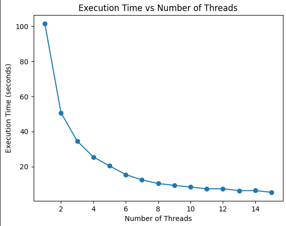
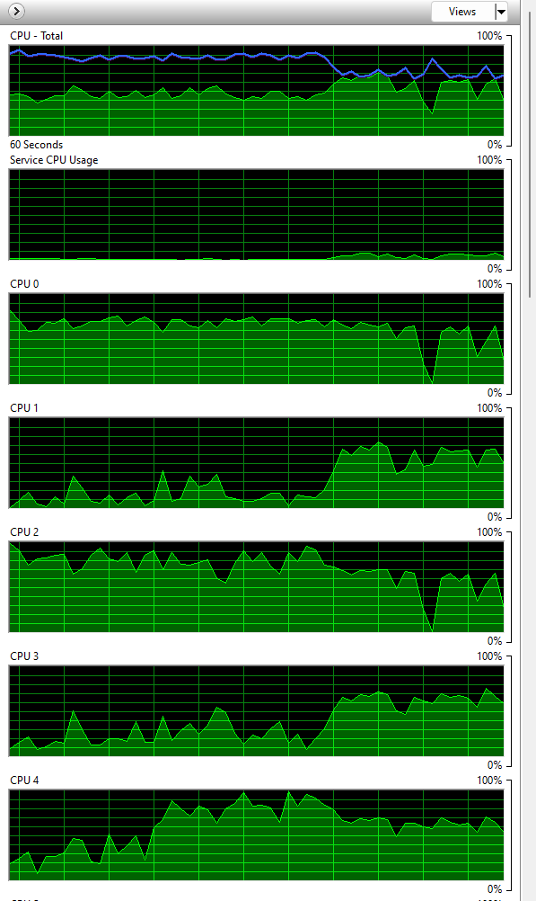
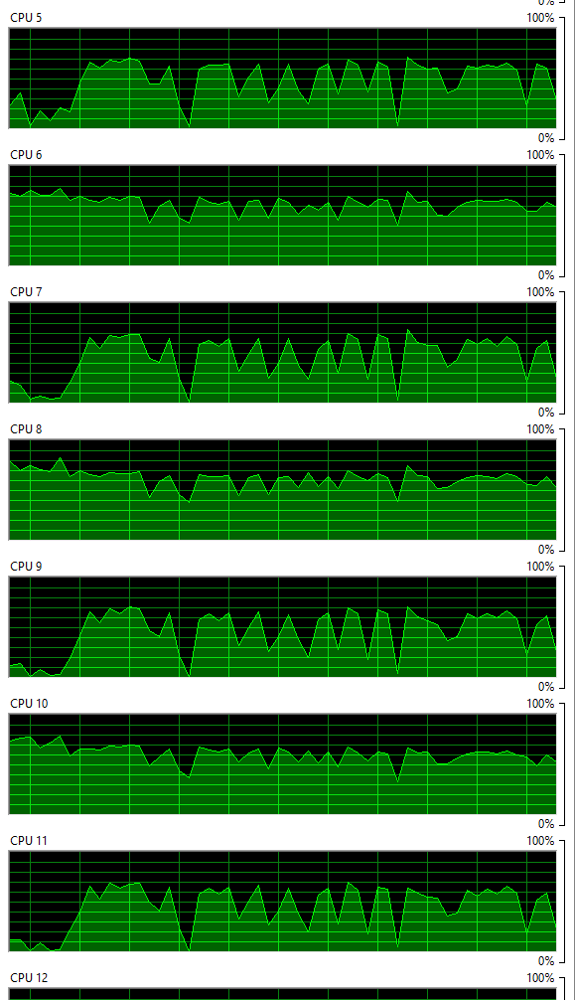
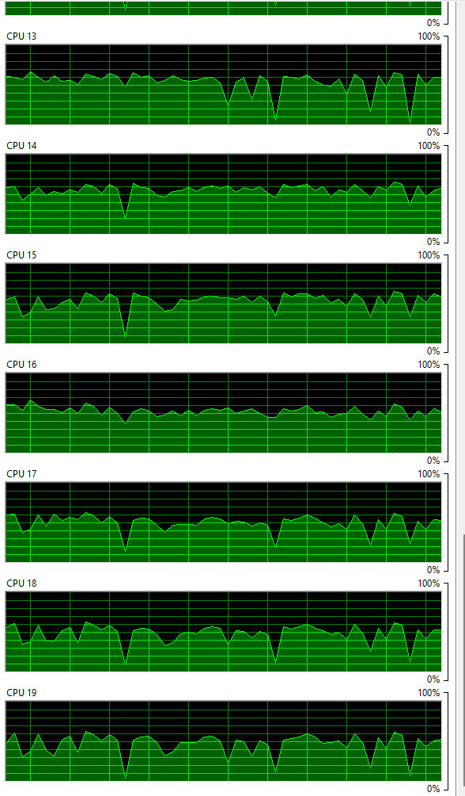

## Methodology

This project aims to assess the influence of thread count on the runtime of matrix multiplication tasks. Through the utilization of multi-threading, the goal is to parallelize matrix multiplication operations and investigate the performance scalability with varying thread counts.

## Data Generation

Random Matrix Generation: Generate 500 random matrices of size 5000x5000 using the NumPy library.
Constant Matrix: Produce a fixed-size 5000x5000 matrix to be multiplied with the random matrices.

## Multi-Threading Implementation

Thread Management: Employ the Python threading module to oversee simultaneous execution of matrix multiplication tasks.

Thread Control: Develop mechanisms to restrict the number of active threads at any given time, mitigating potential resource depletion.

Matrix Multiplication: Each thread undertakes the multiplication of a single random matrix with the constant matrix.

## Experimental Procedure

Sequential Testing: Conduct multiple experiments, altering the thread count from 1 to 2*number of cores i.e 18 in my case.

Performance Evaluation: Document the execution duration for each experiment.

Statistical Assessment: Analyze the gathered data to discern trends and correlations between execution time and thread count.

## Results

| No. of Threads | 1   | 2   | 3   | 4   | 5   | 6   | 7   | 8   | 9   | 10  | 11  | 12  | 13  | 14  | 15  | 
|----------------|-----|-----|-----|-----|-----|-----|-----|-----|-----|-----|-----|-----|-----|-----|-----|
| Time (seconds) | 101.482200 | 50.615800 | 34.512200 | 25.446200 | 20.378700 | 15.412400 | 12.369100 | 10.317600 | 9.264500 | 8.318700 | 7.299200 | 7.318700 | 6.281000 | 6.295900 | 5.310900 |

## Visualisation

## Resource Monitor

